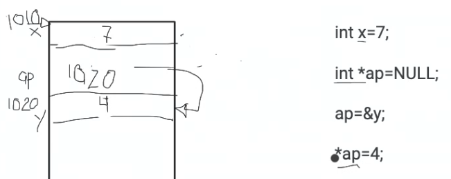
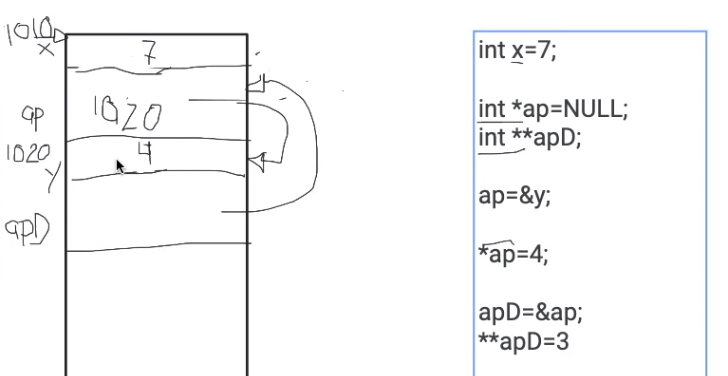
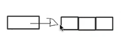
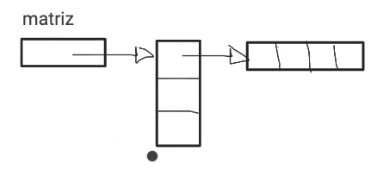

# **POINTERS**

## Introducción

````c
int *p;   //apuntador, dirección de memoria (una variable)
char *p   // Tienes que respetar el tipo

int **p; //direción del apuntador
````

````c
int *p;
int i=5;

p=&i; //dirección de i

*p=7;   //i=7, * es el contenido del apuntador
````

Asterisco entre dos variables -> multiplicación

Asterisco antes de una variable -> apuntador

<u>Tiene sentido usar "``*p=7``" cuando se usan funciones</u> (tamaños)

````c
int x = 10;
int *ap = NULL; //Para que realmente no apunte a nada

ap = &x;
````





<br>

<br>

___


## Memoria dinámica
<br>

``malloc()`` - memory allocation

``free()`` - free memory

<br>





